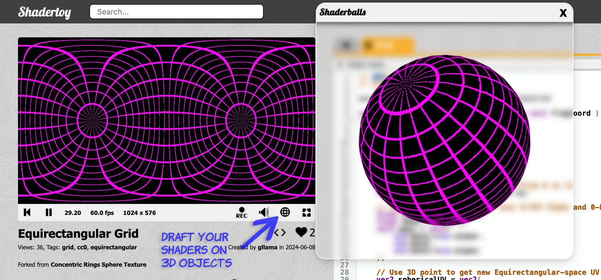

# ShaderBalls

**🎛️ - Your PRs are always welcome! Accepting anything that extends vanilla shadertoy.com functionality.**

## What it does

This extension just includes:

* A firefox/chromium extension to easily preview your shadertoy.com shaders on 3D objects.
* Free, public-domain/CC0-1.0, opensource.
* New button to trigger 3D preview

## How does it function

* This add-on injects JavaScript into https://shadertoy.com pages so it can add new UX and features.
* Powered by popular open-source libs [THREE.js](https://github.com/mrdoob/three.js) and [Camera-Controls](https://github.com/yomotsu/camera-controls).
* Under the hood it uses the the THREE.CanvasTexture to easily map the live-rendered shader onto 3D objects.

## Dev Instructions FireFox

wip

## Dev Instructions Chromium

wip
